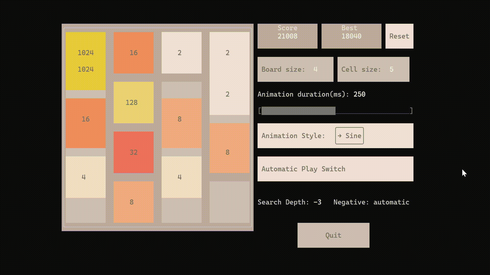

# 2048-cpp #

A tui 2048 game

You can build this software from source code.

```sh
# Clone this repositery
git clone https://github.com/chessom/2048-cpp.git
cd 2048-cpp

mkdir build
cd build
cmake ..
cmake --build .
```

This program is built with [ftxui](https://github.com/ArthurSonzogni/FTXUI/). You also need a modern compiler that supports C++20 to compile this program.
